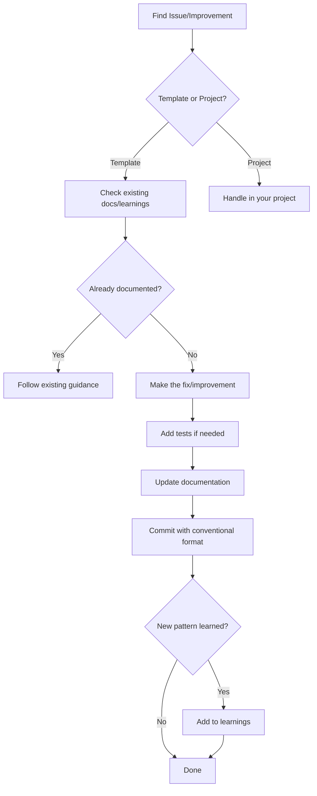

# Contributing to This Template

Guidelines for agents contributing to this project template.

## Types of Contributions

| Type | Description | Example |
|------|-------------|---------|
| Bug fix | Fix issues in template code or config | Broken Makefile target |
| Feature | Add new template capabilities | New MCP tool pattern |
| Documentation | Improve or add docs | Clarify AGENTS.md section |
| Pattern | Document discovered patterns | New error handling approach |

## Before Contributing

1. **Read AGENTS.md**: Understand project structure and rules
2. **Check learnings**: Review `.agents/learnings/` for known patterns
3. **Check existing docs**: Avoid duplicating information
4. **Understand scope**: Is this a template improvement or project-specific?

## Making Changes

### Follow Conventions

- Read @.agents/docs/conventions/naming.md
- Read @.agents/docs/conventions/imports.md
- Use type hints on all functions
- Add docstrings with Args/Returns

### Add Tests

- New features need tests
- Bug fixes should include regression tests
- Run `make test` before committing

### Update Documentation

- Update relevant AGENTS.md files
- Add to learnings if discovering new patterns
- Update command docs if behavior changes

## Commit Guidelines

Follow conventional commits (see @.agents/commands/commit.md):

```bash
# Feature
git commit -m "feat: add new template capability"

# Bug fix
git commit -m "fix: correct Makefile target"

# Documentation
git commit -m "docs: clarify MCP server setup"
```

Keep commits atomic - one logical change per commit.

## Reporting Issues

### When to Report

Report issues when you find:
- **Template bugs**: Something doesn't work as documented
- **Missing guidance**: AGENTS.md lacks needed information
- **Broken patterns**: Documented patterns don't work
- **Inconsistencies**: Docs contradict each other

Do NOT report:
- Project-specific issues (issues in YOUR project, not the template)
- Feature requests without clear use cases
- Style preferences

### Issue Report Format

Create a file in `.agents/learnings/` or document in a task:

```markdown
## Issue: [Brief Description]

**Type:** Bug / Enhancement / Documentation
**Severity:** Critical / High / Medium / Low
**Found in:** [file path or feature]

### Description

What's wrong or missing.

### Steps to Reproduce

1. Step one
2. Step two

### Expected Behavior

What should happen.

### Actual Behavior

What happens instead.

### Suggested Fix

If known, how to fix it.
```

### Where to Document

| Issue Type | Location |
|------------|----------|
| Pattern discovered | `.agents/learnings/` |
| Bug found | `.agents/tasks/` as task |
| Quick fix needed | Fix directly, commit with `fix:` |
| Design question | `.agents/scratch/decisions/` |

### Example Issue Report

```markdown
## Issue: Containerfile fails on ARM64

**Type:** Bug
**Severity:** High
**Found in:** Containerfile

### Description

The UBI9 Python image doesn't have ARM64 variants, causing build failures on Apple Silicon.

### Steps to Reproduce

1. Run `make mcp-container` on ARM64 Mac
2. Build fails with "no matching manifest"

### Expected Behavior

Container should build successfully.

### Actual Behavior

```
Error: no matching manifest for linux/arm64/v8
```

### Suggested Fix

Add multi-arch support or document x86_64 requirement.
```

## Contributing Workflow



## Quick Reference

```bash
# Before starting
cat AGENTS.md                    # Read project rules
ls .agents/learnings/            # Check known patterns

# Making changes
make test                        # Run tests
make lint                        # Check linting
make format                      # Format code

# Committing
git add -A
git commit -m "type: description"

# If you learned something new
cat > .agents/learnings/my-learning.md << 'EOF'
# What I Learned

**Category:** patterns
**Date:** $(date +%Y-%m-%d)

## Learning

Description of what was learned...
EOF
```

## Related

- @AGENTS.md - Project rules and structure
- @.agents/commands/commit.md - Commit format
- @.agents/docs/workflows/pr-process.md - PR workflow
- @.agents/learnings/ - Documented learnings
